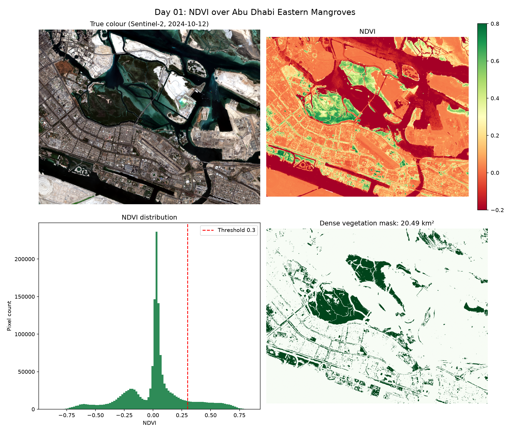

# Day 01: NDVI over Abu Dhabi Eastern Mangroves

Computing NDVI from Sentinel-2 imagery to highlight the mangrove forests east of Abu Dhabi island, and estimating how much area is covered by dense vegetation.



## What is NDVI?

The Normalized Difference Vegetation Index compares how much near-infrared (NIR) and red light a surface reflects:

```
NDVI = (NIR - Red) / (NIR + Red)
```

Healthy vegetation absorbs red light for photosynthesis and strongly reflects NIR, so it scores high (roughly 0.3 to 0.9). Water scores negative, and sand or urban areas sit near 0 to 0.2. In a desert coastline like Abu Dhabi, mangroves stand out very clearly.

## Approach

1. Searched the Microsoft Planetary Computer STAC catalog for Sentinel-2 L2A scenes over the area in 2024 and picked the one with the lowest cloud cover.
2. Loaded Blue (B02), Green (B03), Red (B04), NIR (B08) at 10 m resolution, plus the Scene Classification Layer (SCL).
3. Converted raw values to surface reflectance, including removing the +1000 offset ESA added from processing baseline 04.00 onwards.
4. Masked clouds, cloud shadows and cirrus using SCL.
5. Computed NDVI and thresholded it at 0.3 to estimate dense vegetation area.

## Results


- Scene date: 2024-10-12
- Mean NDVI: 0.019
- Dense vegetation area: 20.49 km²(12.5% of valid area)

## What I learned

I also learned that an NDVI threshold alone cannot distinguish mangroves from other dense vegetation such as parks, golf courses and landscaped areas. The detected 20.49 km² therefore represents dense vegetation, not true mangrove extent. Accurate mangrove mapping would need a classifier trained on labelled samples, and likely additional inputs like water indices or tidal timing to exploit the fact that mangroves sit in the intertidal zone.old cannot distinguish mangroves from other dense vegetation such as parks, golf courses, and landscaped areas. This means the detected 20.49 km² represents dense vegetation rather than the true mangrove extent, and a more targeted classification approach would be needed for accurate mangrove mapping.

## Run it

```bash
pip install -r ../requirements.txt
python ndvi_mangroves.py
```

## Limitations and next steps

- A single NDVI threshold also picks up parks, farms and irrigated green areas, not only mangroves. A proper mangrove map needs a classifier and more indices.
- One date only. Comparing several years would show mangrove growth or loss.

## Data

Sentinel-2 L2A, Copernicus / ESA, accessed via Microsoft Planetary Computer.
