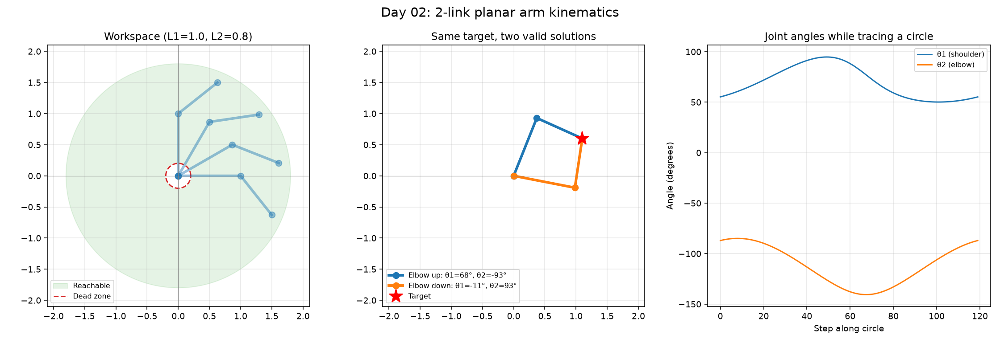
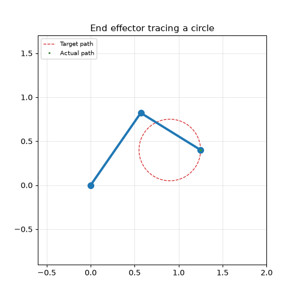

# Day 02: Forward and Inverse Kinematics of a 2-Link Arm

Building the two functions every robot arm needs: one that turns joint angles into a hand position, and one that turns a desired hand position back into joint angles.





## Forward kinematics

Given shoulder angle θ1 and elbow angle θ2, the end effector sits at:

```
x = L1·cos(θ1) + L2·cos(θ1 + θ2)
y = L1·sin(θ1) + L2·sin(θ1 + θ2)
```

Direct, and there is always exactly one answer.

## Inverse kinematics

Going backwards is the harder direction. Using the law of cosines on the triangle formed by the base, elbow and target:

```
cos(θ2) = (x² + y² - L1² - L2²) / (2·L1·L2)
θ1 = atan2(y, x) - atan2(L2·sin(θ2), L1 + L2·cos(θ2))
```

Three things fall out of this that do not exist in forward kinematics:

1. **Two solutions.** Taking the positive or negative arccos gives elbow up or elbow down. Both put the hand in exactly the same place (middle panel above).
2. **Unreachable targets.** Anything further than L1+L2, or closer than |L1-L2|, has no solution. The code raises a clear error instead of returning nonsense.
3. **Floating point edges.** At full stretch the cosine can come out as 1.0000000002 and crash arccos, so it gets clipped to [-1, 1].

## Verification

Rather than trusting the algebra, the script runs IK then FK on a set of targets and measures how far the result lands from where it was asked to go.

Worst round-trip error: **4.0e-16 m**, which is float precision, so the two functions are consistent inverses.

## Results

- Arm: L1 = 1.0 m, L2 = 0.8 m
- Reach: 0.20 m to 1.80 m from the base
- Worst round-trip error (IK then FK): 4.0e-16 m
- Unreachable target (2.5, 0.0) correctly rejected

## What I learned

I assumed inverse kinematics would just be forward kinematics run backwards, but it turns out to be a different problem: the same target can have two valid solutions (elbow up or elbow down), and some points have none at all.

The other thing that stood out was panel 3. The hand traces a clean circle, but the joint angles moving it there are wavy and nonlinear. Simple motion in task space does not mean simple motion in joint space.

## Run it

```bash
python arm_kinematics.py
```

## Next steps

- Pick between elbow up and down by minimising joint movement instead of hard-coding one.
- Extend to 3 links, where there is no longer a neat closed-form solution and numerical methods (Jacobian, gradient descent) take over.
- Add joint limits, since real servos cannot spin freely.
