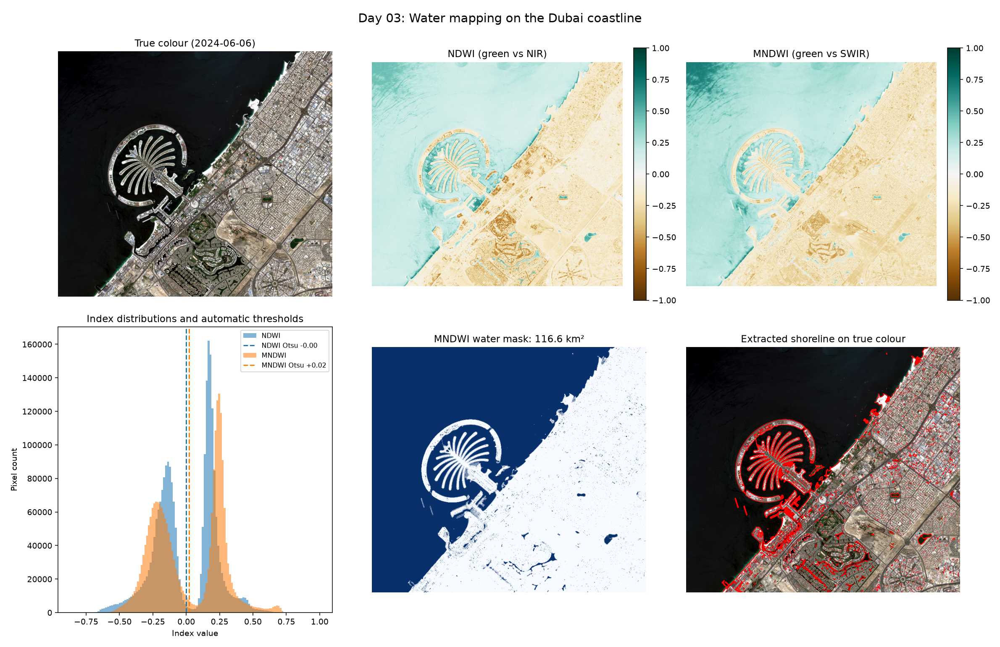

# Day 03: Water Mapping on the Dubai Coastline

Separating water from land using two spectral indices, with the threshold chosen automatically instead of by eye.



## Two ways to find water

Water absorbs infrared strongly and reflects green, so a normalised difference between the two picks it out:

```
NDWI  = (Green - NIR)  / (Green + NIR)      Sentinel-2 B03, B08
MNDWI = (Green - SWIR) / (Green + SWIR)     Sentinel-2 B03, B11
```

MNDWI swaps near-infrared for shortwave infrared. That matters on a coastline like Dubai's, because built surfaces reflect SWIR very differently from water, so MNDWI usually separates buildings from water more cleanly than NDWI does. The disagreement figure printed by the script quantifies this.

## Choosing the threshold automatically

Day 1 used a hard-coded NDVI cut-off of 0.3, which is a guess. Here the threshold comes from **Otsu's method** instead: treat the histogram as two groups, try every possible cut, and keep the one that maximises the variance between the groups. Where a histogram has two clear peaks (land and water), it lands in the valley between them.

It is implemented directly in NumPy rather than imported, since the mechanics are the point.

I sanity-checked it on synthetic data with two known populations before trusting it on the image, and it recovered the correct split.

## The bug that made this day interesting

The first run reported **3.27 km² of water** over a 16 x 14 km stretch of the Dubai coast, which is obviously wrong: most of that box is open sea.

The true colour panel gave it away. Only the top-left corner had pixels, everything else was black. The area of interest straddles two Sentinel-2 tiles, and the script had picked a single scene, so anything outside that one tile was nodata. The histogram confirmed it: a single narrow peak around +0.3 (the sea in that corner) instead of two separated peaks for land and water.

The first fix was to take every scene from the chosen day and let `odc-stac` mosaic them with `groupby="solar_day"`. That raised the water area from 3.3 km² to 48.8 km² and gave the histogram its proper two humps, but a black wedge remained in the corner.

That second gap had a different cause. All scenes from one day come from a single orbit pass, and the box extends past the edge of that pass, so no amount of mosaicking within one day can fill it. The real fix is to check each day's footprint against the box **before** downloading anything, using the polygon geometry already in the STAC metadata, and only accept a day that covers at least 99% of it.

The script now also prints what fraction of the box has valid data and warns below 95%, so this fails loudly next time instead of returning a confident wrong number.

Worth remembering: the water area alone looked like a plausible number. It was the *picture* that exposed the problem.

## Results

- Scene date: 2024-06-06, tiles 40RBN + 40RCN mosaicked, 100% box coverage
- Image: 1635 x 1463 px at 10 m
- Otsu threshold, NDWI / MNDWI: -0.001 / +0.022
- Water area, NDWI / MNDWI: 116.95 km² / 116.56 km²
- The two indices disagree on 2.18% of pixels

## What I learned

The biggest lesson was that a reasonable-looking number does not mean the result is correct. The first water-area estimate seemed possible, and it was only looking at the actual image that exposed that most of the box had no data at all.

I also learned how Otsu's method picks a threshold from the shape of the histogram instead of relying on a value I guess, which is a real improvement on the hard-coded 0.3 I used on Day 1. In theory MNDWI should separate water from built-up surfaces better than NDWI, though on this scene both gave nearly the same total area (116.95 vs 116.56 km²) while still disagreeing on 2.18% of pixels, so the differences cancelled out rather than showing up in the total.

## Run it

```bash
python water_mapping.py
```

## Limitations and next steps

- Otsu assumes the histogram really has two groups. Over an image that is nearly all water, or nearly all land, it will still return a threshold and it will be meaningless.
- Wet sand, swimming pools and shadows sit near the boundary and flip between the two indices.
- Running this across several years would turn it into a coastal change detector, which is interesting here given how much of this shoreline is artificial.

## Data

Sentinel-2 L2A, Copernicus / ESA, accessed via Microsoft Planetary Computer.
