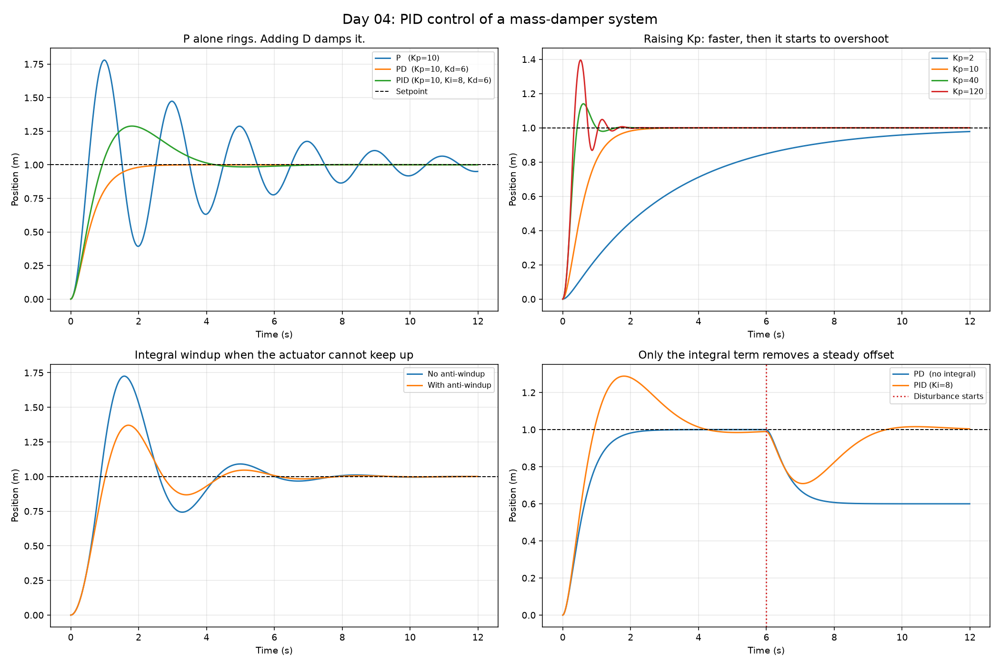

# Day 04: PID Control of a Mass-Damper System

Controlling the position of a 1 kg mass with friction, using each term of a PID controller in turn and seeing what it buys.



## The plant

```
m·x'' + b·x' = F          m = 1 kg, b = 0.5 N/(m/s)
```

A mass that can be pushed along a surface with a little friction. Lightly damped, so it will happily oscillate if the controller lets it.

## The controller

```
u = Kp·e + Ki·∫e dt + Kd·de/dt        where e = setpoint - position
```

Two details that separate a working controller from the textbook formula:

**Derivative on measurement, not error.** A step change in setpoint makes de/dt momentarily infinite, and the controller slams the actuator. Differentiating the measurement instead avoids this "derivative kick" while giving the same damping.

**Anti-windup.** While the actuator is pinned at its limit, the integral keeps accumulating even though more output is impossible. It then has to be unwound before the controller responds normally again, which shows up as a large overshoot. Freezing integration while saturated fixes it.

## What the panels show

**P alone rings.** Because this plant has so little natural damping, proportional control alone oscillates for the full 12 s and never settles inside a 2% band. Adding derivative gain removes the overshoot entirely.

**Raising Kp trades speed for overshoot.** Kp=2 takes nearly 7 s to get there. Kp=120 arrives in 0.21 s but with 39.5% overshoot. Kp=40 is the reasonable middle.

**Windup is visible.** With Ki=20 and the actuator clipped to ±3 N, the same controller overshoots 72.5% without anti-windup and 37.1% with it, and settles 1.4 s sooner.

**The integral earns its place under disturbance, not setpoint.** Worth being precise here: on this plant, P control already reaches the setpoint with no steady-state error, so the usual "add I to remove steady-state error" line does not apply to a step setpoint. Where it does matter is a constant external push. A 4 N disturbance leaves the PD controller sitting 0.400 m short forever. The PID controller integrates that error away and returns to within 0.004 m.

## Results

| Controller | Rise | Overshoot | Settle (2%) | Final error |
|---|---|---|---|---|
| P (Kp=10) | 0.35 s | 77.9% | never | +0.049 m |
| PD (Kp=10, Kd=6) | 1.11 s | 0.0% | 1.96 s | 0.000 m |
| PID (Kp=10, Ki=8, Kd=6) | 0.66 s | 28.8% | 3.90 s | 0.000 m |

Raising Kp with Kd=6, no integral:

| Kp | Rise | Overshoot | Settle |
|---|---|---|---|
| 2 | 6.80 s | 0.0% | never |
| 10 | 1.11 s | 0.0% | 1.96 s |
| 40 | 0.28 s | 14.0% | 1.21 s |
| 120 | 0.21 s | 39.5% | 1.27 s |

Windup, Ki=20 against a ±3 N limit:

| | Overshoot | Settle |
|---|---|---|
| No anti-windup | 72.5% | 7.21 s |
| With anti-windup | 37.1% | 5.78 s |

Disturbance: a constant 4 N push at t=6 s leaves PD 0.400 m short. PID recovers to within 0.004 m.

## What I learned

Each term of a PID controller solves a different problem, rather than simply making the system better. Proportional gain sets the speed, but only up to a point: going from Kp=40 to Kp=120 cut the rise time by 0.07 s and nearly tripled the overshoot. Derivative gain adds damping and removes oscillation. Integral action does little for the step response here, and earns its place against a constant disturbance, where the PD controller sat 0.4 m short indefinitely.

The result that surprised me was that PD beat PID on the step response, with no overshoot and half the settling time. Which controller is "better" depends entirely on whether you expect disturbances.

I also saw how an actuator that cannot keep up causes the integral to wind up, and why anti-windup matters in a real controller rather than just in the equation.

## Run it

```bash
python pid_control.py
```

## Next steps

- Auto-tune with Ziegler-Nichols and compare against these hand-picked gains.
- Add sensor noise, which is what really punishes a high Kd.
- Move from position control of a mass to velocity control of a DC motor, which is closer to the robotics use case.
