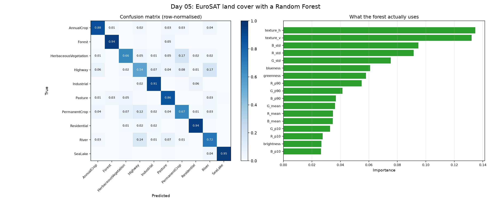

# Day 05: Land Cover Classification on EuroSAT with a Random Forest

The first machine learning day. Ten land cover classes, 64x64 Sentinel-2 chips, a train/test split and a confusion matrix instead of a threshold.



## The dataset

[EuroSAT](https://github.com/phelber/eurosat): 27,000 Sentinel-2 image chips from across Europe, each labelled as one of ten classes (AnnualCrop, Forest, HerbaceousVegetation, Highway, Industrial, Pasture, PermanentCrop, Residential, River, SeaLake). The script downloads the RGB version (about 95 MB) on first run.

## Features by hand, not by network

Each 64x64 image is reduced to 17 numbers:

- mean, standard deviation, 10th and 90th percentile for each of R, G, B
- greenness `(G-R)/(G+R)` and blueness `(B-R)/(B+R)`, crude stand-ins for the vegetation and water indices from Days 1 and 3. EuroSAT RGB has no near-infrared band, so the proper NDVI is not available here.
- overall brightness
- texture: the mean absolute difference between neighbouring pixels, vertically and horizontally. Cities are visually rough, open water is smooth.

This is deliberately not deep learning. The published CNN benchmark on EuroSAT reaches 98.6% using all 13 spectral bands. Seventeen hand-built numbers on three bands will land far below that, and the interesting part is *where* it fails.

## Evaluating it honestly

Three numbers, in increasing order of usefulness:

- **Random guessing**: 10%, since there are ten balanced classes. Any model has to beat this to mean anything.
- **A single decision tree**: one tree, trained on the same features.
- **A random forest**: 300 trees voting. The gap between this and the single tree is what the ensemble buys.

The test set is split off before training and never touched until the end, so the accuracy is on images the model has never seen.

The confusion matrix matters more than the headline accuracy. A model can be 70% accurate and still be useless if the 30% it gets wrong is one class it never identifies.

## Results

## Results

- 8000 images (800 per class), 17 features each. Train 6400, test 1600.

| Model | Accuracy |
|---|---|
| Random guessing | 10.0% |
| Single decision tree | 68.9% |
| Random forest (300 trees) | 80.9% |

Strongest classes: SeaLake (F1 0.97), Forest (0.95), Residential (0.92)
Weakest classes: Highway (F1 0.56), PermanentCrop (0.68), River (0.71)

Most confused pairs:
- HerbaceousVegetation predicted as PermanentCrop, 18%
- Highway predicted as River, 17%
- River predicted as Highway, 14%

Most important features: texture_h and texture_v, by a clear margin over every colour statistic.

## What I learned

The random forest showed me why combining many simple models beats relying on one. Identical features, identical split, and 300 trees scored 80.9% against a single tree's 68.9%.

I also learned that overall accuracy does not tell the full story. The confusion matrix shows exactly which classes the model cannot separate: Highway and River get mistaken for each other in both directions, which makes sense because both are thin dark ribbons through a frame, and every one of my features is a whole-chip average that throws the shape away.

What surprised me most was that the two texture features outranked every colour statistic. I had expected the colour means to dominate, so the crude measure of how much neighbouring pixels differ turned out to be the most useful thing I gave the model. I cannot tell from the importance plot alone which classes it helps most, which would need a per-class test.

I also expected around 60 to 70% accuracy before running it, so 80.9% was higher than I predicted.

## Run it

```bash
pip install -r ../requirements.txt
python landcover_rf.py
```

First run downloads the dataset. Later runs reuse it. `MAX_PER_CLASS` at the top controls how many images are used; raise it for a slower but better model.

## Limitations and next steps

- RGB only. Adding the near-infrared and shortwave bands (EuroSAT_MS, 2.1 GB) would give a real NDVI and should lift the vegetation classes substantially.
- Features are global averages over the whole chip, so all spatial structure is thrown away. A road and a field with the same colours look identical.
- Next: a small CNN on the same split, to see how much the learned features are worth.

## Data

EuroSAT, Helber et al. 2019. Sentinel-2 imagery, Copernicus / ESA. MIT licensed.
