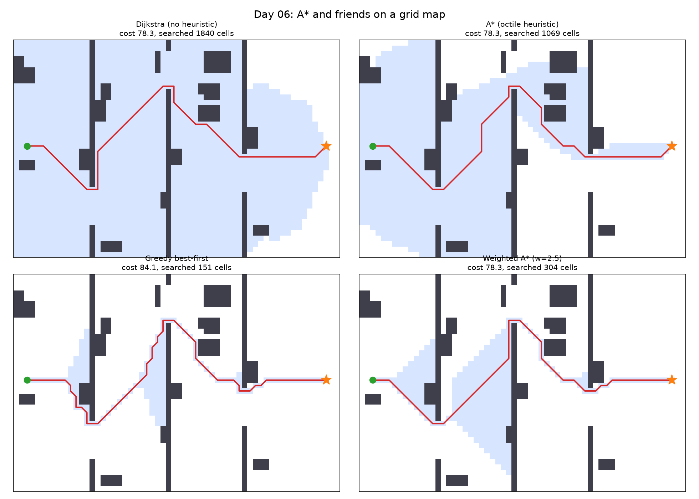

# Day 06: A* Path Planning on a Grid Map

Four searches across the same 60 x 40 map. Same start, same goal, same obstacles. The only thing that changes is how each one decides which cell to look at next.



The shaded blue area is every cell the algorithm actually examined. That area is the real subject of this day, not the red line.

## The four strategies

All of them pull the cheapest cell off a priority queue. The difference is one line: what "cheapest" means.

| Strategy | Priority | Optimal? |
|---|---|---|
| Dijkstra | g (distance travelled so far) | Yes |
| A* | g + h | Yes, if h never overestimates |
| Greedy best-first | h alone | No |
| Weighted A* | g + 2.5h | No guarantee |

`h` is the **octile distance**: the shortest possible route to the goal if the map were empty. For 8-connected movement that is

```
h = (dx + dy) + (sqrt(2) - 2) * min(dx, dy)
```

This matters more than it looks. Because octile distance can never be longer than the true remaining distance, A* is guaranteed to return the optimal path. Use a heuristic that overestimates and that guarantee disappears.

## Movement rules

Eight directions. Diagonal steps cost sqrt(2), straight steps cost 1. Corner cutting is forbidden, so the robot cannot slip diagonally between two obstacles that touch at a corner. Without that rule a planner produces paths that a real robot cannot physically follow.

## Verification

The script asserts that A* returns exactly the same cost as Dijkstra. If an implementation bug broke the admissibility of the heuristic, that assertion would fail rather than quietly returning a slightly worse route.

## Results

Map: 60 x 40, 2179 free cells. Start (2, 20), goal (57, 20).

| Strategy | Cost | Cells searched | Path length |
|---|---|---|---|
| Dijkstra | 78.25 | 1840 | 66 |
| A* (octile) | 78.25 | 1069 | 66 |
| Greedy best-first | 84.11 | 151 | 72 |
| Weighted A* (w=2.5) | 78.25 | 304 | 66 |

Relative to Dijkstra's optimal cost of 78.25:
- A*: same cost, 58.1% as many cells searched
- Greedy: 7.5% longer, 8.2% as many cells
- Weighted A*: same cost, 16.5% as many cells

Assertion passed: A* returns exactly Dijkstra's cost.

## What I learned

The difference between these algorithms is not really the path they return, it is how much of the map they have to look at to find it. Dijkstra searched 1840 cells because it has no idea where the goal is and expands outwards in every direction. A* found the same path for 1069 cells, purely because the heuristic gives it a sense of direction.

Greedy best-first went to the other extreme: 151 cells, about 8% of Dijkstra's effort, but a route 7.5% longer. It commits to heading toward the goal and then has to work around whatever it runs into.

Weighted A* was the one that surprised me. It found the optimal path while searching a sixth as many cells as Dijkstra, even though weighting the heuristic removes the optimality guarantee entirely. That is a result for this map, not a property I can rely on.

## Run it

```bash
python astar_planning.py
```

## Next steps

- Replace the grid with a costmap, where cells near obstacles are expensive but passable, which is how a real robot keeps clearance.
- Add a dynamic obstacle and replan, which is where D* Lite earns its place.
- Smooth the output, since grid paths have 45 degree staircases a real vehicle cannot drive.
