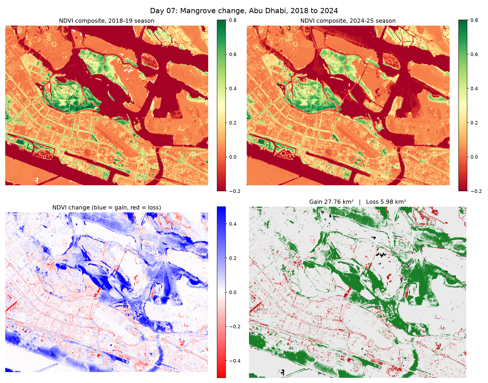

# Day 07: Mangrove Change Detection, Abu Dhabi, 2018 to 2024

Day 01 computed NDVI for a single date. This asks a harder question: has anything actually changed in six years?



## Why one date per year is not enough

Comparing 2018 to 2024 with one image each would measure the wrong thing. NDVI over a coastal mangrove moves on its own for reasons that have nothing to do with the forest:

- **Tide.** At high tide the water covers more of the root system and NDVI drops. Sentinel-2 passes at a fixed local time but the tide is not fixed.
- **Season.** Leaf cover changes through the year, so a January image and a July image are not comparable.
- **Haze and thin cloud.** Both suppress NDVI even when the SCL mask says the pixel is clear.

Two defences here. First, both composites use the **same months** (October to March), so seasonal position is matched. Second, each composite is the **median NDVI across four clear days**, so a single odd day (a high tide, a hazy morning) cannot drive the result. The median is used rather than the mean exactly because it ignores outliers.

## Method

1. For each season, search Sentinel-2 L2A under 10% cloud.
2. Keep only days whose scenes cover at least 99% of the box, the footprint check from Day 03.
3. Take the four clearest of those days, compute NDVI for each, and take the per-pixel median.
4. Difference the two composites and classify each pixel as gain, loss or stable using a threshold of ±0.15 NDVI.

The ±0.15 threshold exists so that ordinary noise is not reported as change. A smaller threshold makes the map look dramatic and means less.

## Verification

The change statistics were tested on synthetic arrays with known patch sizes before being trusted on real imagery: a 100x100 pixel gain patch at 10 m resolution should report exactly 1.00 km², and it does.


## Results

## Results

Composites: 4 clear days each, 2018-19 season (Oct to Dec 2018) and 2024-25 season (Oct 2024 to Mar 2025).
Valid pixel coverage: 99.6% and 100%.

Dense vegetation (NDVI > 0.3):
| Year | Area |
|---|---|
| 2018 | 21.08 km² |
| 2024 | 19.85 km² |
| Net | -1.23 km² |

Pixel-level change (NDVI shift > 0.15):
| Class | Area | Share of valid area |
|---|---|---|
| Gain | 27.76 km² | 17.0% |
| Loss | 5.98 km² | 3.7% |
| Stable | 129.22 km² | 79.3% |

Mean NDVI shift: +0.050

Breaking down the gain:
- Started as open water: 24.31 km², **87.6% of all gain**
- Ended above the vegetation threshold: 2.31 km², 8.3% of all gain
- Water extent: 45.33 km² in 2018, 40.40 km² in 2024

Once the water-to-mudflat pixels are set aside, the picture is consistent: 2.31 km² of real greening against 5.98 km² of loss, matching the 1.23 km² net decline in dense vegetation.

## What I learned

The biggest thing I learned was that a large positive NDVI change does not mean vegetation growth. The 27.76 km² of gain looked impressive until it contradicted the other statistic in the same output: dense vegetation was down 1.23 km² over the same period. Both could not be right.

Breaking the gain down by what each pixel started as explained it. 87.6% of the gain was in pixels that were open water in 2018, where the jump from water (NDVI well below zero) to exposed surface (NDVI near zero) clears the threshold without anything growing. Water extent fell from 45.33 to 40.40 km². Whether that is tide, land reclamation, or both is not something NDVI alone can answer.

With those pixels set aside the numbers agree: 2.31 km² of real greening against 5.98 km² of loss. The lesson is that two statistics disagreeing with each other is useful, because it is what made me look at where the change actually was instead of trusting the headline figure.

## Run it

```bash
python mangrove_change.py
```

Slower than previous days, since it downloads eight scenes rather than one.

## Limitations and next steps

- Matching the months does not match the tide, and this run shows exactly how much that matters. A proper study would filter scenes by tide height from a tide model.
- The "All-NaN slice" warning is expected: a few pixels are masked as cloud or shadow on all four days, so the median has nothing to work with and returns NaN. Those pixels are excluded from every statistic.
- "Vegetation gain" is not the same as "mangrove gain". Irrigated landscaping and parks also green up, and this area has plenty of both.
- Two points in time cannot distinguish a trend from a fluctuation. A full time series across every year would show whether the change is steady or a one-off.

## Data

Sentinel-2 L2A, Copernicus / ESA, accessed via Microsoft Planetary Computer.
