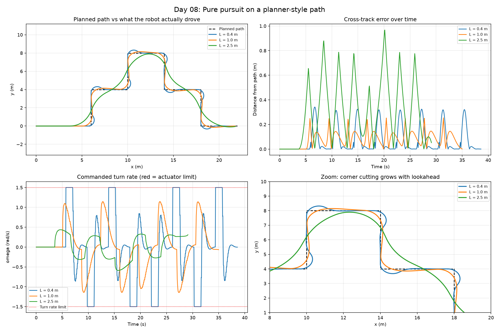

# Day 08: Pure Pursuit Path Following

Day 06 produced a path. This asks whether a robot can actually drive it.



## The gap between a plan and a drive

A grid planner is allowed to turn 45 or 90 degrees instantly, because to the planner a path is just a list of cells. A real differential-drive robot has a forward speed and a maximum turn rate, so a square corner is not something it can execute. It has to approximate.

The robot here is a **unicycle model**:

```
x'     = v·cos(θ)
y'     = v·sin(θ)
theta' = omega        with |omega| <= 1.5 rad/s
```

Speed is fixed at 1 m/s, so the only control is the turn rate.

## Pure pursuit

Pick a point on the path a fixed distance **L** ahead of the robot, then steer along the circular arc that passes through it. For a target at (x, y) in the robot's own frame, that arc has curvature

```
k = 2y / L²        and        omega = v·k
```

That is the entire controller. The interesting part is what L does.

## Choosing the lookahead

Three values, same path, same robot:

- **Short (0.4 m)** hugs the straights but overshoots at every corner, visible as little loops in the zoom panel. It also hits the turn rate limit 27.9% of the time, so for more than a quarter of the run the controller is asking for more than the robot can deliver.
- **Medium (1.0 m)** never saturates the actuator and has the lowest worst-case error.
- **Long (2.5 m)** is smooth and fastest to the goal, but cuts corners by up to a metre, which in a real environment is how a robot clips an obstacle the planner carefully avoided.

The mean error and the worst-case error pick different winners, so there is no single best value here.

## Results

Reference path: 381 points, 38.0 m long. Robot: v = 1.0 m/s, |omega| <= 1.5 rad/s.

| Lookahead | Mean error | Max error | Time to goal | Mean \|omega\| | At turn limit |
|---|---|---|---|---|---|
| 0.4 m | 0.069 m | 0.341 m | 38.7 s | 0.557 rad/s | 27.9% |
| 1.0 m | 0.079 m | 0.254 m | 35.1 s | 0.396 rad/s | 0.0% |
| 2.5 m | 0.298 m | 0.968 m | 29.2 s | 0.258 rad/s | 0.0% |

All three reached the goal.

Lowest mean error: L = 0.4 m. Lowest worst-case error: L = 1.0 m. The two metrics pick different winners.

## What I learned

Following a planned path is not the same as connecting its waypoints. The planner can turn a square corner; the robot has a turn rate limit and has to approximate.

The lookahead distance is where that trade-off lives. At 0.4 m the robot tracked the straights tightly but spent 27.9% of the run asking for more turn rate than it has, which shows up as flat-topped saturation in the command plot and as overshoot loops at every corner. At 2.5 m the motion was smooth and 9.5 s faster to the goal, but it cut corners by nearly a metre, which is how a robot clips an obstacle the planner routed around.

1.0 m was the best compromise here: lowest worst-case error and never once at the turn-rate limit. Worth noting that mean error picked 0.4 m instead, so which lookahead is "best" depends on whether you care about average tracking or worst-case clearance.

## Run it

```bash
python pure_pursuit.py
```

## Next steps

- Slow down for corners instead of cruising at a fixed speed, which is what lets a real robot keep a short lookahead without overshooting.
- Scale the lookahead with speed, the standard fix, rather than fixing it at one value.
- Feed in the actual A* output from Day 06 instead of a representative path, and watch the corner cutting interact with real obstacles.
