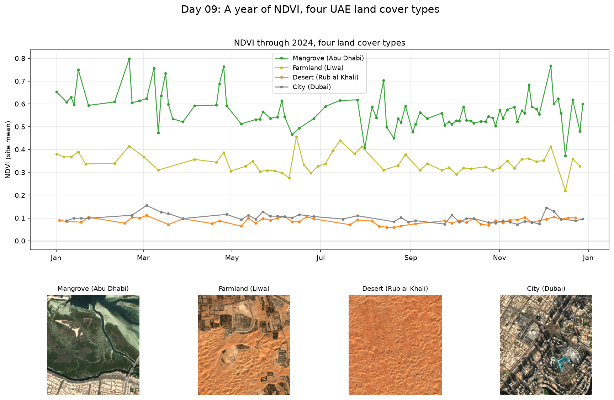

# Day 09: A Year of NDVI, Four Land Cover Types

Days 01, 03 and 07 each looked at one or two dates. This one adds the time dimension properly: every usable Sentinel-2 pass over 2024 for four small sites in the UAE.



## Why a single date is a weak description

A one-date NDVI map tells you how green something was on one morning. It cannot distinguish:

- a mangrove, which is green all year
- an irrigated farm, which is green only when something is planted
- desert, which is never green
- a city, which is a mixture that barely moves

Those four have completely different signatures through a year, and that shape is often more diagnostic than the value on any single day. Crop type classification works on exactly this principle.

## How the time dimension works here

One `odc-stac` load per site returns a cube with dimensions (time, y, x), not a single image. Every operation after that is applied across the whole year at once:

```python
ndvi = (nir - red) / (nir + red)          # a full year, not one date
valid = ndvi.notnull().mean(dim=("x", "y"))   # per-date quality
series = ndvi.mean(dim=("x", "y"))            # collapse space, keep time
```

A date is dropped entirely if less than 60% of its pixels survive cloud masking, which is what stops a half-clouded pass from dragging the curve down.

## Defining a site without trusting a coordinate

Pinning a site to one hand-picked coordinate is fragile. A point that looks like mangrove on a map can be open water, and a point that looks like farmland can be dune, which makes the resulting curve a measurement of something else entirely.

So the vegetated sites are defined as a **box plus a rule**: take a 3 km box and keep only the pixels whose median NDVI across the whole year is above 0.25. Persistent vegetation inside the box gets found wherever it actually sits, and a transient green patch cannot qualify, because the median is taken over every date in the year.

The script reports what fraction of each box survived the mask and warns if it is under 2%, which would mean the box is in the wrong place entirely. Desert and city keep every pixel, since there is nothing to isolate. The true colour chips in the figure are the visual check that each label matches what is actually there.

## Separating season from noise

Max minus min is a poor measure of a seasonal cycle. A single hazy pass or an unlucky tide sets both ends of it, and on a coastal site the curve can jump by 0.4 between passes a few days apart. Vegetation does not grow and shrink in three days.

So the summary reports the 10th to 90th percentile spread, which describes the year without letting one odd date define it, and separately the median NDVI change between passes **less than ten days apart**. Anything moving that fast is noise by definition, so comparing the two numbers says how much of the apparent variation is seasonal and how much is just scatter.

## Results

| Site | Dates used | Mean NDVI | Min to max | p10-p90 spread | Peak | Low |
|---|---|---|---|---|---|---|
| Mangrove (Abu Dhabi) | 84 | +0.572 | +0.373 to +0.797 | 0.174 | Feb | Dec |
| Farmland (Liwa) | 52 | +0.342 | +0.220 to +0.456 | 0.089 | Jun | Dec |
| Desert (Rub al Khali) | 50 | +0.087 | +0.058 to +0.111 | 0.035 | Mar | Aug |
| City (Dubai) | 44 | +0.100 | +0.072 to +0.155 | 0.043 | Mar | Nov |

Vegetation mask kept 49% of the mangrove box and 6% of the Liwa box.

Day-to-day scatter, median NDVI change between passes under ten days apart:

| Site | Scatter | Seasonal spread | Scatter as share of spread |
|---|---|---|---|
| Mangrove | 0.052 | 0.174 | 30% |
| Farmland | 0.030 | 0.089 | 34% |
| Desert | 0.010 | 0.035 | 29% |
| City | 0.014 | 0.043 | 33% |

The ratio is close to one third at every site, so about a third of each apparent yearly range is movement occurring within ten days. None of these four shows a strong seasonal cycle in 2024.

## What I learned

I expected the shape of each curve through the year to be the thing that separated these four classes. It was not. None of the four showed a strong seasonal cycle in 2024, and what actually distinguished them was the level: mangrove around 0.57, farmland around 0.34, desert and city both near 0.09. In hindsight that makes sense for evergreen mangrove and date palm in a climate with no real growing season.

The more useful lesson was that not every change through a year is seasonal. NDVI can jump noticeably between passes only a few days apart, through haze, tide or residual cloud, and a max-minus-min range happily reports that as a seasonal swing. Comparing the p10 to p90 spread against the median change within ten days gave a way to tell the two apart.

That ratio came out close to a third at every site, which says roughly a third of each apparent yearly range is movement too fast to be growth. I had expected the coastal mangrove site to be far noisier than the others because of tide, and it was not.

## Run it

```bash
python ndvi_timeseries.py
```

Four sites, a year of scenes each, so give it a few minutes.

## Limitations and next steps

- The sites are single small boxes, not representative samples of their class. One farm is not all farms.
- The curves are raw per-date means with no smoothing, so residual haze shows up as spikes. A Savitzky-Golay filter is the standard next step.
- Classifying land cover from the *shape* of these curves, rather than from a single date, is where this leads.

## Data

Sentinel-2 L2A, Copernicus / ESA, accessed via Microsoft Planetary Computer.
