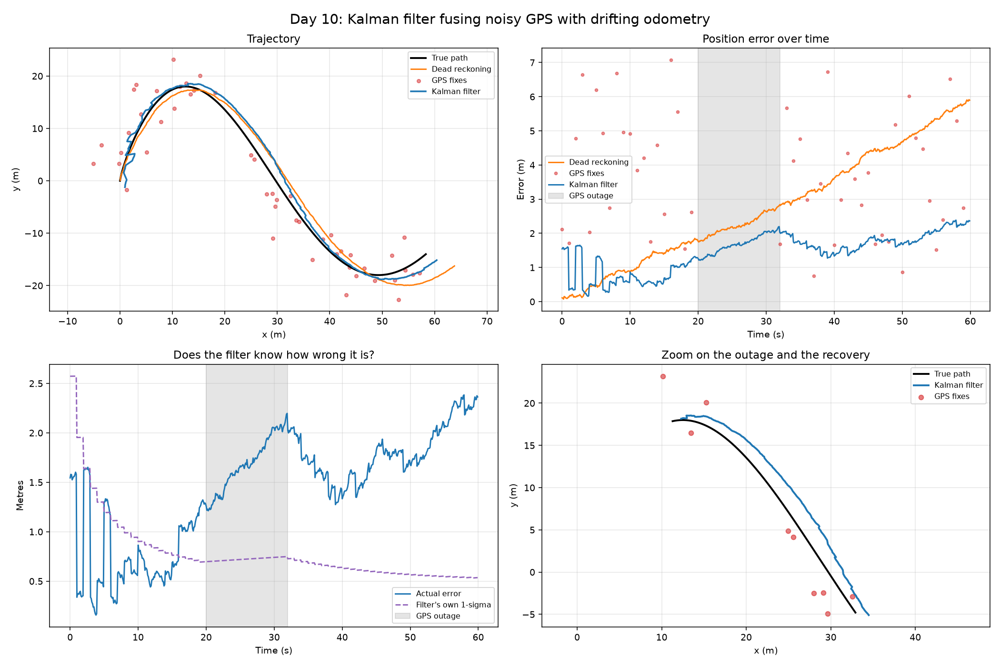

# Day 10: Kalman Filter, Fusing Noisy GPS with Drifting Odometry

Two bad sensors, one decent estimate.



## The two sensors

| Sensor | Rate | Problem |
|---|---|---|
| GPS | 1 Hz | 3 m noise on every fix, and it drops out entirely |
| Odometry | 10 Hz | smooth and fast, but carries a constant unknown bias, so integrating it drifts without limit |

GPS is right on average and wrong every time. Odometry is locally excellent and globally useless. Neither alone is good enough.

## The filter

State is `[x, y, vx, vy]` with a constant velocity model. The robot is actually driving a curve, so that model is always slightly wrong, and the process noise `Q` is the formal statement of how wrong it is allowed to be.

Each step:

1. **Predict** forward with the motion model, and grow the covariance by `Q`
2. **Update** with the odometry velocity measurement
3. **Update** with GPS position, but only when a fix arrives

The Kalman gain decides how much to trust each measurement, based on the covariance the filter is already carrying. No tuning by hand, it falls out of the noise models.

## What the GPS outage shows

Between 20 s and 32 s the GPS is switched off completely. The filter still has odometry and its own model, so it keeps producing an estimate, and the error grows slowly rather than jumping. When GPS returns, the estimate snaps back within a couple of seconds.

This is the behaviour that makes a filter worth having: it degrades instead of failing.

## Checking whether the filter is honest

Beating the raw sensors is not enough. A filter also reports how uncertain it thinks it is, and that number has to be trustworthy, because everything downstream uses it to decide how much to trust the estimate.

For a 2D Gaussian, 39.3% of errors should fall inside the 1-sigma ellipse. The script measures that directly rather than assuming it.

Look at the bottom-left panel: the actual error runs consistently **above** the filter's own 1-sigma line. The filter is overconfident, and the consistency number confirms it.

The cause is the odometry bias. The filter's noise model says odometry errors are zero-mean random noise, but there is a steady bias on top of that, which the filter has no way to represent. So it treats a systematic drift as if it were random, and its covariance never accounts for it.

## Results

60 s run. GPS at 1 Hz with 3 m noise. Odometry at 10 Hz with 0.25 m/s noise and an unknown constant bias of (0.08, -0.05) m/s. GPS outage from 20 s to 32 s.

| Estimator | RMSE | Final error |
|---|---|---|
| GPS alone (at fix times) | 4.12 m | 2.75 m |
| Dead reckoning (odometry) | 3.24 m | 5.90 m |
| Kalman filter (both) | 1.55 m | 2.36 m |

During the 12 s GPS outage:
- Filter error grew from 1.26 m to 2.20 m
- Its own reported uncertainty grew only from 0.70 m to 0.75 m
- Within 2 s of GPS returning: error back to 1.75 m

Consistency: 28.2% of errors fall inside the filter's own 1-sigma ellipse, against 39.3% expected. The filter is overconfident, and its reported uncertainty drifts downward over the run while the actual error climbs.

## What I learned

Two imperfect sensors can produce a much better estimate than either alone. GPS was noisy but bounded at 4.12 m RMSE, dead reckoning was smooth but drifting to 5.90 m by the end, and fusing them gave 1.55 m. The filter is not averaging them, it weights each measurement by how much it already trusts its own state.

The more useful lesson was that low error does not mean the filter is good. It also reports how uncertain it is, and everything downstream believes that number. Here it claimed around 0.7 m while actually being 2.4 m off, and its reported uncertainty drifted *downward* across the run as the real error climbed.

The cause is that the filter's covariance only accounts for noise it was told about. The odometry bias is systematic, not random, so it has no way to represent it and quietly treats a steady drift as if it were nothing.

## Run it

```bash
python kalman_filter.py
```

## Next steps

- **Estimate the bias.** Add `bx, by` to the state vector so the filter can learn the odometry bias instead of being fooled by it. That is the proper fix for the overconfidence above, and it should move the consistency number toward 39%.
- Extend to a non-linear model with a heading state, which needs an EKF or UKF because a rotating robot is not a linear system.
- Feed the filter's output into Day 08's pure pursuit controller, so the robot follows a path using an estimated position rather than a perfect one.
