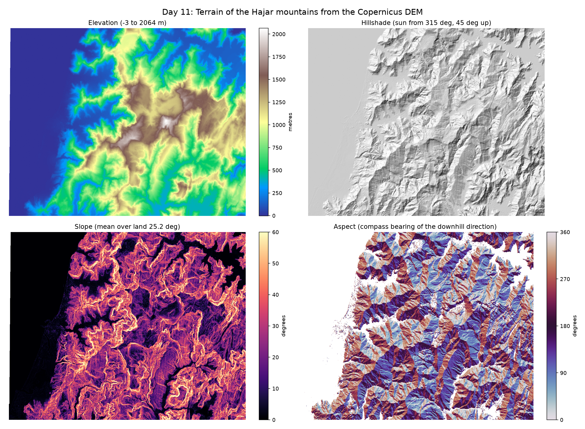

# Day 11: Terrain Analysis of the Hajar Mountains

Every geospatial day so far used reflectance: how much light a surface sends back. This one uses elevation, which is a different kind of raster and needs different maths.



## From heights to three products

The Copernicus DEM GLO-30 is a grid of elevations at 30 m spacing. Three useful things come out of the same calculation, the gradient of that surface:

```
slope     = arctan( sqrt( (dz/dx)² + (dz/dy)² ) )
aspect    = compass bearing of the downhill direction
hillshade = how much light the surface catches from a given sun position
```

Two details decide whether any of this is right.

**The pixel size has to be in metres.** A gradient is rise over run, and the run is a real distance. Computing slope on a DEM still in degrees of latitude and longitude gives numbers that mean nothing, because a degree is not a length. The DEM is reprojected to UTM zone 40N before anything is computed.

**The row axis points south.** `np.gradient` returns change per row and change per column. In a north-up raster the row index increases southward, so the northward gradient is the *negative* of the row gradient. Miss that and north and south come out swapped.

## Aspect is the awkward one

Aspect is the compass bearing of the downhill direction, so a hillside that rises to the east *faces* west, at 270 degrees. Two conventions collide in one line of code:

- the downhill vector has components `(-dz/dx, -dz/dy)` in east and north
- a compass bearing runs clockwise from north, which is `atan2(east, north)`, not the usual `atan2(y, x)`

Flat ground has no aspect at all, so it is left as NaN rather than being quietly reported as facing north.

## Testing it against known answers

A DEM gives no way to tell a correct slope map from a plausible wrong one by eye, so the maths is checked against surfaces whose answer is known exactly before it touches real data:

- a plane rising 1 m per metre is exactly 45 degrees
- a plane rising 0.5 m per metre is exactly arctan(0.5)
- planes rising toward each of the four compass directions face the opposite way
- flat ground has zero slope and undefined aspect

Expected slopes are computed rather than typed as decimals, so the test is exact rather than limited by however many digits got written down.

Testing all four directions matters. An earlier version only tested an east-facing plane, which passed while north and south were silently flipped by 180 degrees. Adding the other two directions caught it immediately.

## The sea in the denominator

The western edge of this box is the Arabian Gulf. The Copernicus DEM gives it an elevation of about 0 m rather than nodata, so it is perfectly valid, perfectly flat terrain as far as the gradient calculation is concerned.

Left in, it sits in the denominator of every statistic. "Mean slope" becomes an average over land and sea together, and "percent of the area steeper than 20 degrees" is diluted by a block of water that is steeper than nothing.

The number looked reasonable, which is exactly why it is worth checking. On a synthetic DEM that is half flat sea and half a true 45 degree slope, including the sea reports a mean of 22.3 degrees. The land is still 45.

Statistics are now reported over land only, defined as elevation above 5 m, with the all-inclusive figure printed alongside so the size of the effect is visible. The maps still show the whole box, because the sea is part of the picture even when it is not part of the question.

## Results

Copernicus DEM GLO-30, 2 tiles, 1175 x 932 px at 30 m.
Elevation: -3 m to 2064 m, mean 573 m.
Sea and near-sea-level ground (below 5 m): 19.5% of the box, excluded from the slope statistics.

| Slope statistic | Over land | If the sea is counted |
|---|---|---|
| Mean | 25.2 deg | 20.4 deg |
| Median | 25.2 deg | 19.9 deg |
| Max | 78.6 deg | 78.6 deg |
| Steeper than 10 deg | 80.1% | 64.3% |
| Steeper than 20 deg | 61.8% | 49.6% |
| Steeper than 30 deg | 38.3% | 30.7% |
| Steeper than 40 deg | 17.0% | 13.7% |

Aspect, counting only land steeper than 5 degrees:

| Sector | Share |
|---|---|
| North (315-45) | 21.5% |
| East (45-135) | 29.3% |
| South (135-225) | 22.1% |
| West (225-315) | 27.1% |

A randomly oriented landscape would give about 25% per sector. The excess facing east and west is consistent with a linear range whose ridges run roughly north to south.

The aspect figures are nearly unchanged by excluding the sea, because they were already filtered to ground steeper than 5 degrees, which removes flat water anyway. Only the slope statistics were affected.

## What I learned

Terrain analysis is far more sensitive to coordinate conventions than I expected. Slope is rise over run, so the run has to be a real distance: computing it on a DEM still in degrees gives numbers that mean nothing. The same applies to the row axis, which points south in a north-up raster, and getting that sign wrong flips north and south by 180 degrees while leaving east and west perfectly correct.

That asymmetry is the part worth remembering. A slope or aspect map always looks plausible, so there is no way to catch it by eye. Testing against planes with a known answer caught it immediately, but only once the test covered all four compass directions rather than just one.

The other lesson was that correct maths can still produce misleading statistics if the area being measured includes something irrelevant. The Arabian Gulf along the western edge is valid, perfectly flat terrain as far as the gradient is concerned, and it was 19.5% of the box. Leaving it in put mean slope at 20.4 degrees instead of 25.2, and "steeper than 10 degrees" at 64.3% instead of 80.1%.

## Run it

```bash
python terrain_analysis.py
```

The DEM is a few megabytes, so this is faster than the Sentinel-2 days.

## Limitations and next steps

- A 30 m DEM smooths away anything narrower than about 60 m, so cliff faces read as gentler than they really are. Slope statistics are always resolution-dependent, and quoting one without the resolution is meaningless.
- The Copernicus DEM is a surface model, so it includes buildings and trees. Over a city that is a feature; over a forest it overstates the ground.
- Aspect drives sun exposure, which drives vegetation. Overlaying this on the NDVI work from Day 09 would show whether north-facing slopes here hold more vegetation.
- Slope is the natural input to a costmap, which connects directly to the A* planner from Day 06: a robot should route around a 35 degree slope even though it is not an obstacle.

## Data

Copernicus DEM GLO-30, ESA, accessed via Microsoft Planetary Computer.
