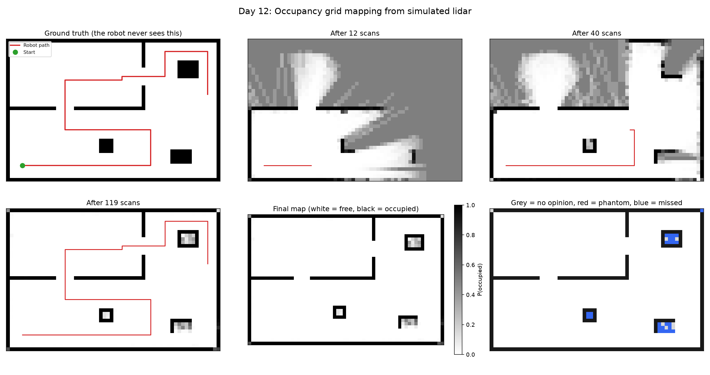

# Day 12: Occupancy Grid Mapping from Simulated Lidar

Day 06 planned a path across a map that was handed to it. A real robot has to build that map itself, out of noisy range measurements taken from wherever it happened to be standing.



## The inverse sensor model

A lidar beam reports one number: how far away something is. Turning that into a map means asking the reverse question, what does this reading say about every cell the beam passed through?

- every cell **before** the endpoint is evidence of free space
- the **endpoint** cell is evidence of an obstacle
- everything **behind** the endpoint is unaffected, because the beam never got there

Cells are tracked in **log odds** rather than probability, so combining evidence is addition instead of repeated Bayes updates:

```
log_odds += L_OCCUPIED   at the endpoint      (+0.85)
log_odds += L_FREE       along the ray        (-0.40)
p = 1 / (1 + exp(-log_odds))
```

Log odds are clamped to ±6. Without a clamp a cell that has been seen as a wall two hundred times reaches a probability so close to 1 that no amount of contrary evidence can ever move it again, and a map that cannot change its mind is useless the moment a door opens.

Bresenham's line algorithm picks the cells along each ray, so every cell the beam actually crossed gets marked rather than only those near the endpoints.

## A beam that returns nothing

A real lidar cannot distinguish "nothing out there" from "that surface did not reflect". Both arrive as an empty return, and what you do with them is a genuine design decision rather than a detail.

**Trusting them** as free space clears the entire ray out to maximum range. When the dropout was a genuine miss off a real surface, that carves a line straight through solid geometry. In this run 2% of beams drop out, and over 119 scans that is enough to hollow out the interiors of the free-standing blocks.

**Discarding them** keeps those obstacles intact but throws away real evidence about genuinely empty space, so more of the map stays unexplored.

The script runs the whole route both ways and reports the cost of each.

## Checking it before trusting it

Two things are verified before any mapping happens.

**The log odds arithmetic**, against values that can be worked out by hand: a single occupied reading gives p = 0.701, a single free reading gives p = 0.401, ten occupied readings converge toward the clamp, and the clamp genuinely prevents certainty.

**The route**, against the world. A robot cannot stand inside a wall, and a scan taken from inside one reports that wall's own cells as empty, quietly eating obstacles out of the finished map. An early version of this route put ten of its poses inside solid geometry; the map still looked plausible and the only symptom was a slightly worse score. `validate_route` now refuses to run at all, and the self-test confirms the validator itself rejects a bad pose rather than being decoration.

## Results

World: 60 x 40 cells at 0.25 m (15 x 10 m). Lidar: 180 beams per scan, 8 m max range, 2% of beams return nothing.
119 scans, 19463 beam returns.

| Dropout handling | Precision | Recall | Missed obstacles | Unknown |
|---|---|---|---|---|
| Trust as free space | 100.0% | 89.4% | 26 | 0.3% |
| Discard entirely | 100.0% | 90.4% | 5 | 1.1% |

Of 312 true obstacle cells, 279 were found. No phantom obstacles in either mode.

Every missed cell is the interior of a free-standing block, never a wall. Discarding dropouts cuts missed obstacles from 26 to 5, at the cost of leaving 1.1% of the map unexplored instead of 0.3%.

## What I learned

A robot can build its own map from range readings alone, by treating every beam as evidence about each cell it crossed: free along the ray, occupied at the endpoint. Keeping that in log odds rather than probability is what makes combining thousands of readings just addition.

What surprised me was how much damage a small sensor fault does. Only 2% of beams return nothing, but trusting those as empty space clears a line straight through anything that failed to reflect, and over 119 scans that was enough to hollow out the interiors of every free-standing block: 26 missed obstacle cells instead of 5.

The part I had not thought about is that precision and recall are not equally important here. Both modes had 100% precision and no phantom obstacles, so the only errors were missed ones. A phantom obstacle makes a robot take a longer route. A missed obstacle makes it drive into something. Choosing how to treat an ambiguous reading is a safety decision, not a tuning parameter.

## Run it

```bash
python occupancy_grid.py
```

Pure NumPy and matplotlib, no download, a few seconds.

## Limitations and next steps

- **The pose is assumed perfect.** This is mapping with known poses, not SLAM. Day 10's Kalman filter showed how quickly an estimated pose drifts, and feeding a drifting pose into this would smear every wall. Closing that loop is the actual problem.
- Each beam is treated as independent evidence, which overcounts: 180 beams from one position are far more correlated than 180 beams from 180 positions.
- The 0.25 m cell size sets a floor on what can be represented. A chair leg is invisible at this resolution whatever the sensor does.
- The finished grid is exactly the input Day 06's planner wanted, so the natural next step is planning a path across a map the robot built itself rather than one it was given.
