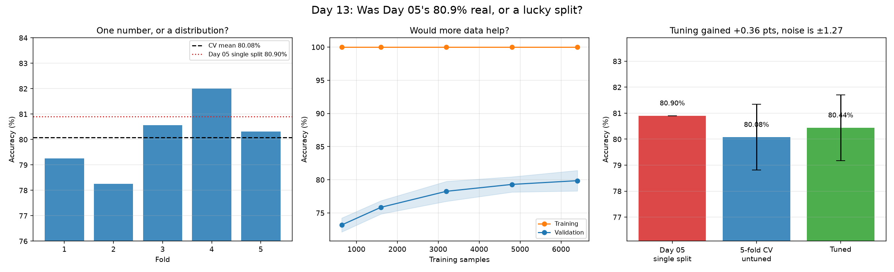

# Day 13: Was Day 05's 80.9% Real, or a Lucky Split?

Day 05 trained a Random Forest on EuroSAT, measured 80.9% on one held-out test set, and stopped. That is a single sample from a distribution, reported as if it were the distribution.



## Four questions a single split cannot answer

**1. How much does the number move?** Five-fold stratified cross-validation trains and tests five times on different partitions. The spread between folds is how much of 80.9% was the model and how much was the draw.

**2. Would more data help?** A learning curve trains on 10%, 25%, 50%, 75% and 100% of the data. If validation accuracy is still climbing at the right-hand edge, more images would help. If it has flattened, the features are the ceiling and collecting more data is wasted effort.

**3. Does tuning help?** A grid search over the parameters that control how much each tree can memorise.

**4. Is the tuning gain bigger than the noise?** This is the one that matters. A gain smaller than the fold-to-fold spread is not a result, it is a different draw.

## Two deliberate choices

**`n_estimators` is not in the grid.** Adding trees to a random forest reduces variance and never causes overfitting, so it trades compute for a little stability rather than being an accuracy knob. Searching over it mostly burns time. The three parameters that are in the grid, `max_depth`, `max_features` and `min_samples_leaf`, all control how much an individual tree is allowed to memorise, which is where overfitting actually lives.

**Features are cached.** Reading 8000 JPEGs takes minutes and the result never changes, so it is extracted once into `features_cache.npz`. Every later experiment on the same data is then nearly free. The images themselves are reused from Day 05 rather than downloaded again.

## Checking the harness before trusting it

An evaluation harness that reports a good score on nonsense is broken, and it fails silently. So before any real data is loaded:

- **Pure noise** goes in: random features, random labels. It has to come back at chance (10% for ten classes). Anything higher means the harness is leaking test data into training.
- **A perfectly separable problem** goes in. It has to come back at 1.000, or something is broken in the other direction.
- **The learning-curve subsets** are checked for class coverage.

That last check exists because of a real bug. `learning_curve` takes a *prefix* of each training fold by default, and these features are loaded class by class, so the smallest subset contained **one class out of ten**. The resulting curve rose steeply from 10% to 97% and looked like a textbook illustration of more data helping. It was really just classes being added back in. Passing `shuffle=True` fixes it, and the self-test now asserts that shuffling widens the class coverage of a small subset so it cannot come back unnoticed.

## Results

8000 samples, 17 features, 10 classes. 5-fold stratified cross-validation.

| Measure | Value |
|---|---|
| Day 05, single split | 80.90% |
| 5-fold CV mean | 80.08% |
| 5-fold CV std | 1.27% |
| Fold spread (max - min) | 3.75 points |
| Folds | 79.25, 78.25, 80.56, 82.00, 80.31 |
| Tuned CV accuracy | 80.44% |
| Best parameters | max_depth=None, max_features=0.5, min_samples_leaf=1 |
| Gain from tuning | +0.36 points |

Learning curve:

| Training samples | Train | Validation | Gap |
|---|---|---|---|
| 640 | 100.00% | 73.19% | 26.81 |
| 1600 | 100.00% | 75.85% | 24.15 |
| 3200 | 100.00% | 78.26% | 21.74 |
| 4800 | 100.00% | 79.30% | 20.70 |
| 6400 | 100.00% | 79.86% | 20.14 |

Day 05's 80.90% sits above the cross-validated mean and inside the fold range, so it was a mildly favourable split rather than a wrong one. Tuning gained +0.36 points against a fold-to-fold standard deviation of 1.27, so it is inside the noise. The learning curve is still rising at the right-hand edge, by +0.56 points over the last 1600 samples, so more data would help slightly even though tuning does not.

## What I learned

Getting 80.9% on one test split does not mean the model performs at 80.9%. Cross-validation turned that single number into a distribution: mean 80.08%, standard deviation 1.27, and folds ranging from 78.25% to 82.00%. Day 05's result was a mildly favourable draw rather than a wrong one, but with a 3.75-point spread between folds, any single split is worth about plus or minus a point and a half on its own.

What surprised me was how little tuning bought. Twelve parameter combinations gained 0.36 percentage points, against a fold-to-fold standard deviation of 1.27. The gain is comfortably inside the noise, so it is not a result at all.

The learning curve answered a different question and gave a different answer. Validation accuracy is still climbing at the right-hand edge, by 0.56 points over the last 1600 samples, so more data would still buy something even though more tuning would not. Those are two separate questions and I had been treating them as one.

## Run it

```bash
python cross_validation.py
```

The first run extracts features from Day 05's images and caches them. The grid search is 12 combinations across 5 folds at 300 trees, so expect several minutes.

## Limitations and next steps

- Cross-validation measures variance from the split. It says nothing about whether EuroSAT itself represents the places this model would be used, and a model trained on European imagery applied to the UAE is a different question entirely.
- The grid is small and deliberately so. A larger search with the same five folds starts fitting the folds themselves, which is overfitting one level up. A nested cross-validation is the honest way to search widely.
- If the learning curve is flat, the next move is better features rather than more data or more trees. The near-infrared bands EuroSAT also ships are the obvious place to start, since Days 01 and 09 showed how much NDVI separates vegetation that RGB cannot.
