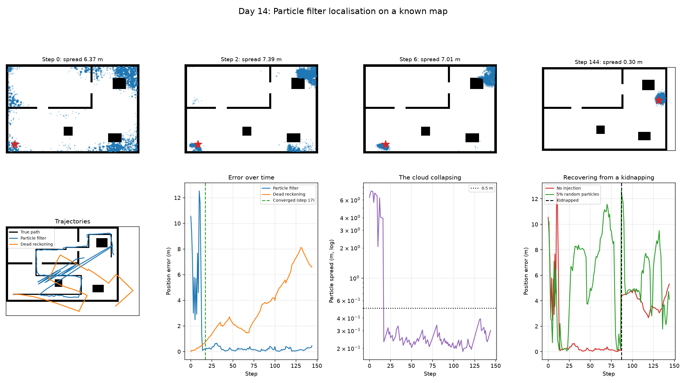

# Day 14: Particle Filter Localisation on a Known Map

Day 10 tracked a robot with a Kalman filter. Day 12 built a map but assumed the pose was known exactly. This closes that gap for the harder case: the robot is switched on somewhere in a building it has a map of, and has no idea where.



## Why not a Kalman filter

A Kalman filter represents belief as a single Gaussian: one place, with an ellipse of uncertainty around it. "Somewhere in this building, could be anywhere, possibly facing any direction" is not a Gaussian and cannot be squeezed into one.

A particle filter represents the belief as a cloud of concrete guesses. That lets it hold several incompatible hypotheses at the same time and let the measurements decide.

The top row of the figure shows exactly that. At step 2 the cloud has collapsed onto **two** clusters, the true position and a twin in the opposite corner that the map's symmetry supports equally well. Both are live hypotheses. By step 6 the twin is dying, and by step 17 only one survives. A Gaussian would have had to average those two clusters into a point halfway between them, which is a place the robot definitely is not.

## The measurement model

Scoring 12,000 particles against 16 beams by ray casting would be 192,000 ray marches per step. Instead the map is preprocessed once into a **likelihood field**: the distance from every cell to the nearest obstacle.

Scoring then becomes, for each particle and beam: project where the beam would have ended if this particle were the true pose, look up that point's distance to the nearest obstacle, and score with a Gaussian. One array index instead of a ray march. The whole thing is a few vectorised NumPy operations.

Beams returning maximum range are dropped. They mean "nothing out there", which a likelihood field cannot express, and scoring them punishes correct particles standing in open space.

## Three bugs, and what each one taught

**Particles off the map scored perfectly.** Beam endpoints get clipped to the array bounds, and the map border is a wall, so every clipped endpoint reported a distance of zero. A particle that had drifted far outside the building therefore got a flawless score. The filter was rewarding particles for being nowhere, and the cloud flew apart to a 16 m spread instead of converging. `pose_is_possible` now zeroes any particle outside the map or inside a wall. This is not a refinement; without it the filter does not work at all.

**Too few particles to find the answer.** With 2,000 particles over 2,088 free cells and a continuous heading, exactly **one** particle started within 0.4 m and 25 degrees of the truth. A filter cannot converge on a hypothesis it never sampled. Raising the count to 12,000 fixed it.

**Resampling destroyed diversity.** After the first aggressive resample every particle was a duplicate of a handful of parents. Identical particles score identically forever, so the effective sample size stayed high, resampling stopped firing, and the filter was locked into its first guess. Adding a small jitter after resampling (roughening) keeps the cloud alive.

## Checking it before trusting it

The self-test verifies the likelihood field is zero on obstacles and positive in free space; that a particle at the true pose outscores wrong ones; that off-map and in-wall particles score exactly zero; that effective sample size is N for uniform weights and 1 when one particle holds everything; and that systematic resampling concentrates on heavy particles.

`validate_route` and `validate_kidnap` check the scenario itself. The second exists because the first version of the kidnapping experiment teleported the robot **into a wall**, where it stayed for all 58 remaining steps. A scan taken from inside a wall matches no particle, so recovery was impossible by construction and the experiment measured nothing. It looked like a finding about particle filters. It was a bug in my test setup.

## Blind injection costs more than it buys

Once a particle filter converges, every particle is in one place. If the robot is then picked up and moved, there is nothing left near the truth to recover with. The obvious fix is to keep replacing a slice of the cloud with fresh random guesses.

Measured, that fix is worse than the problem. At a constant 5% injection per resample:

- **While the filter was tracking correctly**, mean error went from 0.20 m to 6.44 m, 32 times worse, because a steady trickle of random particles never lets the cloud settle. Spread rose from 0.25 m to 3.03 m.
- **After the kidnapping** it still did not recover. Final error improved from 4.90 m to 3.46 m, which is not localisation, just a mean dragged around by noise.

The arithmetic says why recovery fails. A correctly placed particle 29 degrees off in heading has its weight collapse from 0.9996 to 0.00005, so a useful random particle needs the right cell (about 1 in 2,088) *and* a heading inside roughly 50 of 360 degrees. Around 1e-4 per particle.

This is the argument for an **adaptive** injection rate, which is what Augmented MCL does: track the average measurement likelihood, inject nothing while the scans still fit the map, and inject hard only when that likelihood collapses, which is the actual signal that the robot has been lost. A constant rate pays the cost every single step and only sometimes gets the benefit.

## Results

Map: 60 x 40 cells (15 x 10 m), 2088 free cells. 12,000 particles, 16 beams, starting with no idea where the robot is.

| Measure | Value |
|---|---|
| Initial particle spread | 6.37 m (the whole map) |
| Steps to converge below 0.5 m | 17 of 145 |
| Final particle spread | 0.30 m |
| Particle filter error after convergence | mean 0.192 m, max 0.649 m |
| Dead reckoning error over the same span | mean 3.757 m, max 8.126 m |
| Dead reckoning final error | 6.585 m, still growing |
| Effective sample size | min 299, median 6727, of 12,000 |

Kidnapped robot, moved 4.27 m at step 87 into free space:

| Injection rate | Mean error before kidnap | Final error after | Recovered? |
|---|---|---|---|
| 0% | 0.20 m | 4.90 m | no |
| 5% per resample | 6.44 m | 3.46 m | no |

Cloud spread over the same pre-kidnap span: 0.25 m without injection, 3.03 m with.

After convergence the filter is roughly 20x more accurate than dead reckoning, and its error stays flat while dead reckoning's grows without bound. Constant-rate injection degraded normal tracking 32x and still did not achieve recovery.

## What I learned

A particle filter can hold several incompatible beliefs at once. At step 2 the cloud had collapsed onto two clusters, the true position and a twin in the opposite corner that the map's symmetry supported equally well, and both stayed alive until the measurements killed one. A Kalman filter cannot represent that at all: forced to a single Gaussian, it would have put the estimate halfway between the two clusters, which is a place the robot definitely was not.

Particle diversity turned out to be the thing everything depends on. The filter can only ever pick from hypotheses it has actually sampled, so once the correct one is gone there is nothing to recover with. The same arithmetic broke it twice: at 2,000 particles exactly one started near the truth and it never converged, and after a kidnapping a useful random particle needs both the right cell (1 in 2,088) and a heading within about 50 of 360 degrees, roughly 1e-4 each.

The kidnapping experiment surprised me. Continuously injecting random particles made normal tracking 32 times worse, 0.20 m to 6.44 m mean error, because the cloud never settles, and it still failed to recover. A fix that pays its cost every step and collects its benefit rarely is a bad trade. Recovery has to be adaptive: inject only when the measurements stop fitting the map.

## Run it

```bash
python particle_filter.py
```

12,000 particles across 145 steps, plus two more runs for the kidnapping test. A couple of minutes.

## Limitations and next steps

- **The map is assumed perfect and static.** Day 12 built a map with 89% recall and some missing obstacles, and localising against a map with holes in it is harder than this.
- Running this against a map the robot built itself, rather than ground truth, is the step that turns localisation into SLAM.
